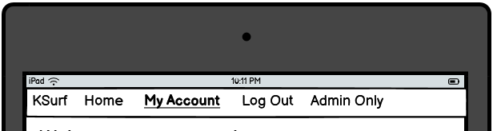
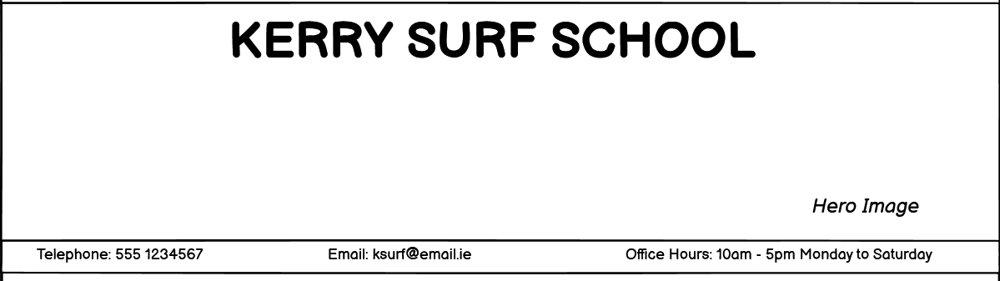
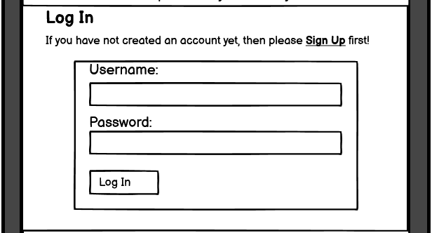
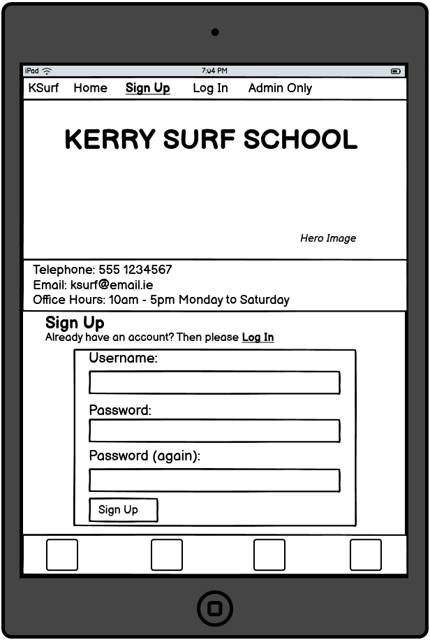
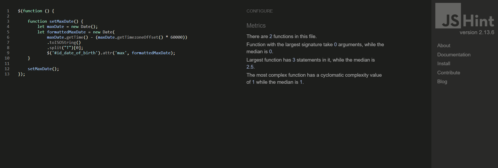

# Portfolio Project 4 - Kerry Surf School README

## 1. Purpose of the Project

Kerry Surf School is a small owner run business teaching surfing lessons and hiring out surfing equipment. The business currently has an online presence via its social media accounts and through a Google Business Profile but it does not have its own website. Most of the surfing lessons are booked over the phone without a requirement to pay when booking. Payments are taken in person on the day of the lesson. Walk-ins are also accepted for lessons if room is available. The majority of equipment hire customers are walk-in customers.

Now the business has decided to create its own website in the hope of increasing business volumes. The business would like to have two key elements initially. Firstly it would like to provide information on the services it currently provides. Secondly it would like to have an option for potential customers to book its most popular beginner-level and intermediate-level lessons online. To begin with, the business is happy to allow customers book online and pay on the day of the lesson as this is how it also manages phone bookings as previously mentioned.

Assuming that the creation of the website leads to benefits for the business, Kerry Surf School would envisage adding additional features to the website over time. These include the ability to book a range of equipment/clothing, to book more advanced lessons with or without equipment and to book private lessons. Futhermore, it would like to eventually have the option to process payments online.

Finally, as a longer term business goal, Kerry Surf School has begun researching the possibility of selling surfing equipment. If it decides at some point in the future to commence equipment sales, it sees online sales as a likely key aspect of such a strategy.

## 2. User Stories - Minimum Viable Product (MVP)

1. As a **Visiting User** I can **view information about the lessons available** so that **I can determine whether the business provides the surf lesson I require.**

2. As a **Visiting User** I can **view information about the equipment available to rent** so that **I can determine whether the business provides the equipment I need.**

3. As a **Visiting User** I can **view contact information for the business** so that **I can call or email the business to make enquires or bookings.**

4. As a **Visiting User** I can **book standard lesson type options online** so that **I can go online at a time convenient to me and make a booking.**

5. As a **Visiting User** I can **view my bookings online** so that **I can go online at any time convenient to me to confirm the details of any bookings I have made.**

6. As a **Visiting User** I can **amend my bookings online** so that **I can go online at any time convenient to me and make changes to any bookings I have made.**

7. As a **Visiting User** I can **cancel my bookings online** so that **I can go online at any time convenient to me and cancel some or all of the bookings I have made.**

8. As a **Site Admin User** I can **view and filter bookings** so that **I can plan for expected customer volumes.**

9. As a **Site Admin User** I can **amend bookings** so that **in the event of any particular problem arising such as a lack of available staff, bookings can be adjusted in consultation with customers.**

10. As a **Site Admin User** I can **close a specific lesson time and type to further bookings** so that **I can avoid inconvenience to the business and its customers by automated acceptance of bookings to lessons already determined to be full.**

## 3. Features

Please note that the features section contains relevant extracts from the project wireframes. The complete wireframes are included in section 6 of this document.

### 3.1 Navigation Bar

* The navigation bar provides a link to return to the home page from any other page. This link will be highlighted to indicate when a user is on the homepage.

* When no user is logged in the navigation bar provides links to sign-up or log-in.

* When a user is logged in the link to log-out replaces the log-in or sign-up options.

Fig. 3.1.1 Navigation Bar with no user logged in.

Fig. 3.1.2 Navigation Bar with a user logged in.

### 3.2 Header

* The header contains the business name "Kerry Surf School" as an h1 heading in a prominent location on the page.

* The header contains a hero image with a theme related to the purpose of the website.

Fig. 3.2.1 Header

### 3.3 Home Page Main Section

* The main section contains a link, in the form of a card, to commence the booking process. This is the key call to action on the home page. This link will bring the user to the page with options to log in or sign up.

* The main section contains a link, in the form of a card, to information regarding surfing lessons. This information is located further down on the home page. This link is therefore a section link within the page.

* The main section contains a link, in the form of a card, to information regarding equipment hire. This information is located further down on the home page. This link is therefore a section link within the page.

* On mobile devices the three items will be displayed beneath each other in an accordion format.

Fig. 3.3.1 Home Page Main Section on Desktop

Fig. 3.3.2 Home Page Main Section on Mobile

### 3.4 Footer

* The footer contains links to social media.

* The footer is sticky, always appearing at the bottom of the view.

### 3.5 Sign Up/ Log In Page

* This page is reached by clicking on the booking option on the home page.

* The main section on this page contains links to the sign up or sign in options.

* There is also a brief explainer regarding the need to create an account. This is in the form of a dropdown box on the mobile version.

Fig. 3.5.1 Sign Up/ Log In

### 3.6 Sign Up Form

* The page containing this form is reached either by clicking on sign up on the navigation bar or by clicking on the appropriate link on the sign up or log in options page.

* The form contains a field to enter a unique username and fields to enter and confirm a user password.

* The form has a submit button to process the entered information.

Fig. 3.6.1 Sign Up Form

### 3.7 User Account First Log In

* This page will appear after a user creates an account.

* This page will contain a form for the provision of an email address and telephone number for the management of bookings.

* A short explainer is provided regarding the data collected.

Fig. 3.7.1 Email and Phone Number Form

### 3.8 Log In Form

* The page containing this form is reached either by clicking on log in on the navigation bar or by clicking on the appropriate link on the sign up or log in options page.

* The form contains a field to enter a username and user password.

* The form has a submit button to process the entered information.

Fig. 3.8.1 Log In Form

### 3.9 Customer Account Page Main Section

* The main section of this page contains a customer greeting.

* The main section of this page contains a summary of customer information.

* The main section of this page contains links to create, view, edit and cancel bookings.

Fig. 3.9.1 Customer Account Page Main Section

### 3.10 Create Booking Form

* This form is reached by clicking the appropriate link on the customer account page.

* This form gathers the necessary data for each individual's booking including first name, last name, date of birth, height, weight, ability level, booking date and booking time.

* A submit button allows creation of the booking and its storage onto the database.

Fig. 3.10.1 Create Booking Form

## 4. Future Features

The following future features could be added in time:

1. The ability to create and save numerous individual profiles within a user account to allow for quicker completion of future bookings. Allowing several profiles under one customer account, would for example allow a parent to create one account but then create individual profiles for each family member.

2. The ability to book equipment hire online.

3. The ability to book a broader range of lessons including private lessons with or without equipment hire included.

4. The ability to make payments online.

5. The creation of an online shop for surfing equipment sales.

## 5. Typography and Color Scheme

### 5.1 Typography

The main page heading is also the business name "Kerry Surf School". It has the main surfer hero image as a background and has the font style Bubblegum Sans. This was chosen for its fun, informal relaxed style and was considered to be very much in keeping with the surfing theme.

All other text uses the Quicksand font-style. This style is clear and easy to read while maintaining a somewhat informal look and works well with the Bubblegum Sans heading text.

### 5.2 Color Scheme

As the site is for a surf school it was decided that the appearance of the website should be inspired by sea, surf, sand, and sunshine.

Therefore a color palette consisting of blues, browns, oranges, reds, and purples was considered appropriate.

#7acdf3 is a light blue color and it has been used throughout the website including as the background color for the navigation bar, the footer and a nuber of link buttons. The color fits within the color scheme theme as outlined above and provides a good contrast when reading text.

#3dbcf7 is a slightly darker blue and has been used as the hover color for link buttons. It provides sufficient contrast to the lighter blue above so as to fulfill its function in providing feedback to the user when they hover over a clickable link.

#f1e2d3 is a light brown color and is used as the main background color for the site. It fits within the theme above and contrasts nicely with all other elements on the page.

#620da7 is a rich, deep purple color and has been used for the main page title, the business name, "Kerry Surf School" on larger screens when the title is located to the left of or at the top of the image. The colour is in keeping with the overall theme and provides the required contrast with the background image.

#e9d1d1 is a light orange-pink color and has been used for the main title when it is located towards the bottom of the background image on smaller screens. The location of the surfer within the image on smaller screens requires the title to be displayed toward the bottom of the image. However the purple color #620da7 does not provide sufficient contrast with the color within the background image at this location and so this lighter color is used. Likewise, this lighter color would not provide the required contrast at other locations within the image and therefore the purple color is used as described above.

#d3ccc5 is a brown that provides a small degree of contrast with the main background color and has been used to provide a subtle outline to the booking card on larger screens and to form input fields.

#246bad is a darker blue and has been used to provide a top border to the footer so as to ensure it is always distinguishable even when clickable links and accordion elements with the same background color overlap it.

## 6. Wireframes

### 6.1 Home Page on Desktop

### 6.2 Home Page on Mobile

### 6.3 Sign Up/ Log In on Desktop

### 6.4 Sign Up/ Log In on Mobile

### 6.5 Sign Up

### 6.6 Log In

### 6.7 User Account after first Log In

### 6.8 User Account

### 6.9 Create Booking

## 7. Database Entity Relationship Diagram

## 8. Technology

The following technologies were used in developing and deploying the website:

* Python

* HTML

* CSS

* Javascript

* Django

* Cloudinary

* Bootstrap

* jQuery

* Jest

* django-allauth

* Google Fonts

* The IDE used was GITPOD

* The repository used is GITHUB

* GITHUB issues, projects and boards are used to implement Agile practices.

* The website is deployed on Heroku.

* Balsamiq was used to prepare wireframes.

* Lucidchart was used to prepare the Database Entity Relationship Diagram.

* favicon.io was used to generate the website favicon.

* Google Chrome was used as the main web browser both for accessing the IDE and the repository as well as to view the application locally and on Heroku during development.

* Developer Tools in Google Chrome were used to test the application during development and following completion.

* Microsoft Edge and Mozilla Firefox were used to test cross browser compatibility.

* The W3C Markup Validation Service was used for HTML code validation.

* The W3C CSS Validation Service was used for CSS code validation.

* JS Hint was used for javascript/jquery validation.

* The Code Institute Python Linter was used for python validation.

## 9. Testing

### 9.1 Code Validation

#### 9.1.1 HTML Code Validation

HTML code validation was carried out using the W3C Markup Validation Service. All code was successfully validated as outlined hereunder.
For public pages validation was undertaken by URI as follows:

Home page at : https://mf-pp4-kerry-surf-school.herokuapp.com/

Fig. 9.1.1.1 HTML Validation Result for Home page

Sign Up or Log In links page at : https://mf-pp4-kerry-surf-school.herokuapp.com/signuporlogin/

Fig. 9.1.1.2 HTML Validation Result for Sign Up or Log In links page

Sign Up page at : https://mf-pp4-kerry-surf-school.herokuapp.com/accounts/signup/

Fig. 9.1.1.3 HTML Validation Result for Sign Up page

Log In page at : https://mf-pp4-kerry-surf-school.herokuapp.com/accounts/login/

Fig. 9.1.1.4 HTML Validation Result for Log In page

For pages requiring a logged in user validation was undertaken by Direct Input as follows:

Customer First Log In page to create customer Profile:

Fig. 9.1.1.5 HTML Validation Result Customer First Log In page

Customer Profile page:

Fig. 9.1.1.6 HTML Validation Result Customer Profile page

Make Booking page:

Fig. 9.1.1.7 HTML Validation Result Make Booking page

View Bookings page:

Fig. 9.1.1.8 HTML Validation Result View Bookings page

Edit Booking page:

Fig. 9.1.1.9 HTML Validation Result Edit Booking page

Edit Profile page:

Fig. 9.1.1.10 HTML Validation Result Edit Profile page

Log Out page:

Fig. 9.1.1.11 HTML Validation Result Log Out page

Custom 404 page:

Fig. 9.1.1.12 HTML Validation Result Custom 404 page

#### 9.1.2 CSS Code Validation

CSS code validation was carried out using the W3C CSS Validation Service. The project contains a single custom css file styles.css. It was tested by direct input and was successfully validated.

Fig. 9.1.2.1 CSS Validation Result for styles.css

#### 9.1.3 Javascript/jquery Code Validation

Javascript code validation was carried out using JS Hint.  Each file was tested by direct input and was successfully validated as follows:

**File: date.js**

Fig. 9.1.3.1 js Validation Result for date.js

**File: dateOfBirth.js**

Fig. 9.1.3.2 js Validation Result for dateOfBirth.js

**File: delete.js**

Fig. 9.1.3.3 js Validation Result for delete.js

**File: editBooking.js**

Fig. 9.1.3.4 js Validation Result for editBooking.js

**File: editProfile.js**

Fig. 9.1.3.5 js Validation Result for editProfile.js

**File: script.js**

Fig. 9.1.3.6 js Validation Result for script.js

This jsHint validation shows one undefined variable bootstrap. However this is a bootstrap alert method that is imported separately and is available to the code at runtime.

#### 9.1.4 Python Code Validation

In the first instance python validation has been implemented by way of constant monitoring of the problems list in the IDE. A number of problems remain but these do not relate to custom project code as outlined hereunder. All other files were found to be free of problems.

**File: env.py**

Fig. 9.1.4.1 IDE Problems list for env.py

The two errors here are due to lines being too long but this is as a result of the length of urls from external sources.

**File: settings.py**

Fig. 9.1.4.2 IDE Problems list for settings.py

All the errors here are due to lines being too long.
Four of the five errors are in the Django provided code that has been left as provided.
One of the errors results from the length of provided cloudinary method names.

In addition all key files containing custom code were tested using the Code Institute Python Linter and were found to be error free. Examples of tests for key files are shown hereunder:

**File: views.py**

Fig. 9.1.4.3 Code Institute Python Linter Result for views.py

**File: models.py**

Fig. 9.1.4.4 Code Institute Python Linter Result for models.py

**File: forms.py**

Fig. 9.1.4.5 Code Institute Python Linter Result for forms.py

**File: admin.py**

Fig. 9.1.4.6 Code Institute Python Linter Result for admin.py

**File: admin_filters.py**

Fig. 9.1.4.6 Code Institute Python Linter Result for admin_filters.py

### 9.2 Test Cases
### 9.3 Fixed Bugs
### 9.4 Supported Screens and Browsers
### 9.5 Accessibility and Performance
## 10. Deployment
### 10.1 via gitpod
### 10.2 via github pages

## 11. References and Credits

### 11.1 References

* The Code Institute student Template for Gitpod provided by Code Institute at https://github.com/Code-Institute-Org/gitpod-full-template. This template allows easy set up of a repository and workspace.

* The Code Institute Hello Django and I Think therefore I Blog example projects provided within the online learning system (LMS). These provide general guidance as to minimun project requirements. They also provide an overview of best practice and industry conventions. Furthermore they outline the key aspects of the Django framework, the process to import Django into the IDE and the process to deploy a production version to Heroku.

* The Code Institute Principles of Agile Development module provided by Code Institute within its online learning system (LMS). This module provides information on Agile theory as well as systems for its practical implementation that have been applied to this project.

* Django version 3.2 documentation available at https://docs.djangoproject.com/en/3.2/. Django is the full-stack framework technology used to develop this project.

* Python version 3.8 documentation available at https://docs.python.org/3.8/. Python is the backend programming language used in the Django full-stack framework technology used to develop this project.

* Cloudinary documentation available at https://cloudinary.com/documentation. Cloudinary has been used as the remote persistent storage for media and static files on this project.

* Bootstrap version 5.3 documentation available at https://getbootstrap.com/docs/5.3/getting-started/introduction/. Bootstrap has been used throughout this project to create page styles and components.

* jQuery documentation available at https://jquery.com/. jQuery has been used for event handling and DOM manipulation including to aid responsivness.

* Jest documentation available at https://jestjs.io/docs/getting-started. Jest has been used as the Javascript testing framework for this project.

* django-allauth documentation available at https://django-allauth.readthedocs.io/en/latest/index.html. django-allauth has been used for user sign up/ log in/ authentication.

* fontpair information on font styles and pairings at https://www.fontpair.co/.

* Google Fonts documentation available at https://fonts.google.com/. Google Fonts has been used to import The Bubblegum Sans and the Quicksand font styles.

* w3schools information on the matchMedia() js method at https://www.w3schools.com/jsref/met_win_matchmedia.asp.

* w3schools information on using the addEventListener() js method to attach the "resize" event on the window object at https://www.w3schools.com/jsref/event_onresize.asp.

* w3schools information on input type date at https://www.w3schools.com/tags/att_input_type_date.asp.

* w3schools information on the HTML select tag at https://www.w3schools.com/tags/tag_select.asp.

* Answer by username ladhari to a question on Stack Overflow at https://stackoverflow.com/questions/20138049/redirect-user-to-another-url-with-django-allauth-log-in-signal for information on having seperate django redirects for sign up and log in.

* Real Python information on using current user instance in the backend via request.user at https://realpython.com/django-view-authorization/.

* "How to Safely Pass Data to JavaScript in a Django Template" by Adam Johnson. This article is available on his website at https://adamj.eu/tech/2022/10/06/how-to-safely-pass-data-to-javascript-in-a-django-template/. It was used to source information and code snippets for the use of data attributes to transfer data from the edit_booking template to the edits.js file. This was used to fill the current booking data into the edit booking form for date inputs when a simple prepopulated Django form would not provide the date picker functionality.

* Answer by John Slegers to a question on Stack Overflow available at https://stackoverflow.com/questions/23593052/format-javascript-date-as-yyyy-mm-dd#:~:text=The%20simplest%20way%20to%20convert,(%22T%22)%5B0%5D%3B for information on, and a code snippet to, convert a date to an ISO string date, including allowing for timezones. This is required in edits.js as part of the process of supplying existing booking date data to the edit form.

* w3schools information on the jQuery val() Method at https://www.w3schools.com/jquery/html_val.asp.

* w3schools information on the jQuery attr() Method at https://www.w3schools.com/jquery/html_attr.asp

* Answers by both username "c-smile" and username "Pointy" to a question on Stack Overflow available at https://stackoverflow.com/questions/6131119/jquery-attribute-selector-variable for information on the correct syntax when using the jQuery attribute selector with a variable as the value.

* "Converting 12 hour format time to 24 hour format in JavaScript" by tutorials point. This article is available at https://www.tutorialspoint.com/converting-12-hour-format-time-to-24-hour-format-in-javascript. It was used to source information and a code snippet for converting time to 24 hour format that was then adapted for the purposes of this project in the edits.js file. This conversion is used in the process required to fill the current booking data for lesson time into the edit booking form as the simple prepopulated Django form would not provide the dropdown select time options.

* w3schools information on the HTML data-* attribute available at https://www.w3schools.com/tags/att_data-.asp.

* "How to Get the data-id Attribute of an Element Using jQuery" by TutorialRepublic, available at https://www.tutorialrepublic.com/faq/how-to-get-the-data-id-attribute-of-an-element-using-jquery.php#:~:text=Alternatively%2C%20you%20can%20also%20use,the%20statement%20like%20%24(this). This was a source for guidance on combined use of a data attribute with the jQuery attr() method.

* "How to use Django Messages Framework" by JAYSHA on ORDINARY CODERS available at https://ordinarycoders.com/blog/article/django-messages-framework for information on creating custom alerts using Django messages.

* Answer by Mahdi Zare to a question on Stack Overflow at https://stackoverflow.com/questions/27064206/django-check-if-a-related-object-exists-error-relatedobjectdoesnotexist for information on using ObjectDoesNotExist from django.core.exceptions.

* "Dynamic classes in navbar" from Django World by Yash Patel available at https://www.youtube.com/watch?v=qLG6B6yWH58 for code and information regarding the addition of the active class to the correct link in the navbar of a base template.

* mdn web docs information on the HTML input type "tel" and the pattern attribute available at https://developer.mozilla.org/en-US/docs/Web/HTML/Element/input/tel.

* Django admin DateFieldListFilter class source code available at https://github.com/django/django/blob/main/django/contrib/admin/filters.py#L313 for the initial code that was then adapted to produce a custom filter class for bookings called CustomDateFieldListFilter inheriting from DateFieldListFilter.

* Contributions by Alain Boyer and user10261970 on Stack Overflow available at https://stackoverflow.com/questions/51975488/extending-django-admins-datefieldlistfilter-for-custom-upcoming-filter for guidance on customising the DateFieldListFilter class.

* Contribution by indianwebdevil on Stack Overflow available at https://stackoverflow.com/questions/61604603/display-data-from-related-model-in-django-admin-interface-for-a-model-object for code snippet to display data from a related model in the django admin list display of the current chosen model.

* Contribution by Danny W Adair on Stack Overflow available at https://stackoverflow.com/questions/2217488/age-from-birthdate-in-python for python code snippet to calculate an age from a date of birth.

* Contributions by sherpya, gtalarico and Jieter on Stack Overflow available at https://stackoverflow.com/questions/37539132/display-foreign-key-columns-as-link-to-detail-object-in-django-admin for code snippets and guidance on creating a link to an object in a related database in the display list for the current database.

* The W3C Markup Validation Service available at https://validator.w3.org/ for HTML code validation.

* The W3C CSS Validation Service available at https://jigsaw.w3.org/css-validator/ for CSS code validation.

* JS Hint available at https://jshint.com/ for javascript/jquery validation.

* The Code Institute Python Linter available at https://pep8ci.herokuapp.com/ for python validation.

### 11.2 Credits

* Hero Image by Pixabay and taken from pixels.com: https://www.pexels.com/photo/man-surfing-on-waves-390051/.

* Surf Lessons photo by Elle Hughes and taken from pixels.com: https://www.pexels.com/photo/group-of-people-carrying-surfboards-1549196/

* Gear Hire photo by Monica Silvestre and taken from pixels.com: https://www.pexels.com/photo/yellow-and-red-surfboards-near-blue-calm-body-of-water-699955/

* Image size and format adjusting by Reduce Images: https://www.reduceimages.com/

* Favicon generation by favicon.io: https://favicon.io/

* Fellow students in the KCETB-Code Institute cohort for the feedback, advice, and, constant discussion of all things code.

* Ms. Irene Neville, Code Institute cohort facilitator, for the provision of or signposting towards all key pieces of information needed to ensure the successful completion of the project to the required standards.

* Mr. Rohit Sharma (Mentor) for guidance on overall project approach, industry standards and, README requirements.