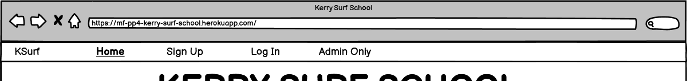
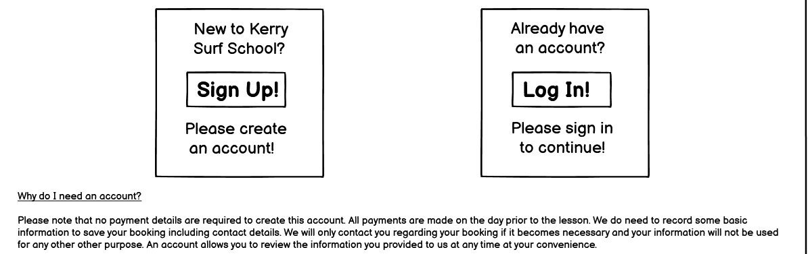
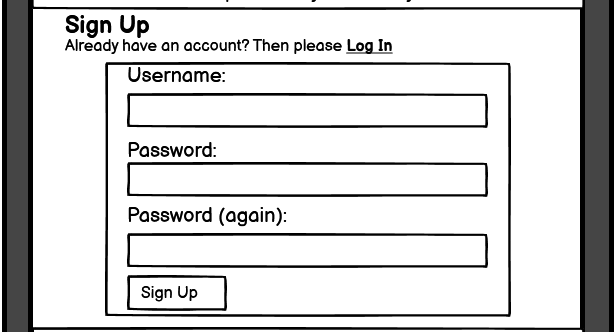
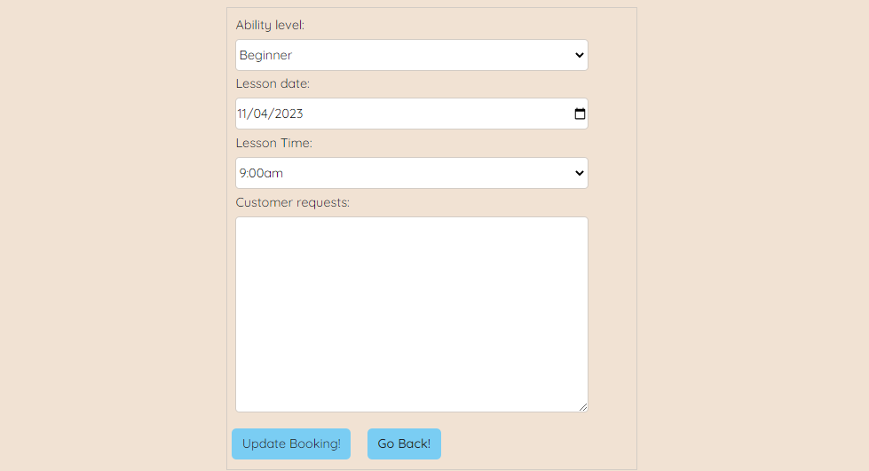

# Portfolio Project 4 - Kerry Surf School README

## 1. Purpose of the Project

Kerry Surf School is a small owner-run business teaching surfing lessons and hiring out surfing equipment. The business currently has an online presence via its social media accounts and through a Google Business Profile but it does not have its own website. Most of the surfing lessons are booked over the phone without a requirement to pay when booking. Payments are taken in person on the day of the lesson. Walk-ins are also accepted for lessons if room is available. The majority of equipment hire customers are walk-in customers.

Now the business has decided to create its own website in the hope of increasing business volumes. The business would like to have two key elements initially. Firstly it would like to provide information on the services it currently provides. Secondly it would like to have an option for potential customers to book its most popular beginner-level and intermediate-level lessons online. To begin with, the business is happy to allow customers book online and pay on the day of the lesson as this is how it already manages phone bookings.

Assuming that the creation of the website leads to benefits for the business, Kerry Surf School would envisage adding additional features to the website over time. These include the ability to book a range of equipment/clothing, to book more advanced lessons with or without equipment and to book private lessons. Futhermore, it would like to eventually have the option to process payments online.

Finally, as a longer term business goal, Kerry Surf School has begun researching the possibility of selling surfing equipment. If it decides at some point in the future to commence equipment sales, it sees online sales as a likely key aspect of such a strategy.

## 2. User Stories - Minimum Viable Product (MVP)

1. As a **Visiting User** I can **view information about the lessons available** so that **I can determine whether the business provides the surf lesson I require.**

2. As a **Visiting User** I can **view information about the equipment available to rent** so that **I can determine whether the business provides the equipment I need.**

3. As a **Visiting User** I can **view contact information for the business** so that **I can call or email the business to make enquires or bookings.**

4. As a **Visiting User** I can **book standard lesson type options online** so that **I can go online at a time convenient to me and make a booking.**

5. As a **Visiting User** I can **view my bookings online** so that **I can go online at any time convenient to me to confirm the details of any bookings I have made.**

6. As a **Visiting User** I can **amend my bookings online** so that **I can go online at any time convenient to me and make changes to any bookings I have made.**

7. As a **Visiting User** I can **cancel my bookings online** so that **I can go online at any time convenient to me and cancel some or all of the bookings I have made.**

8. As a **Visiting User** I can **receive onscreen confirmation messages for actions such as making a booking** so that **I can be confident I have successfully completed the required task.**

9. As a **Visiting User** I can **add more of my details to my customer profile** so that **I do not need to re-enter them for every booking.**

10. As a **Visiting User** I can **include any special requests with my booking** so that **I do not need to contact the business again having already submitted a booking.**

11. As a **Site Admin** I can **approve bookings with a system visible on the admin side only** so that **I can monitor booking volumes against my available staff resources on any given day and review any special requests.**

12. As a **Site Admin** I can **view and filter bookings** so that **I can plan for expected customer volumes.**

13. As a **Site Admin** I can **amend bookings** so that **in the event of any particular problem arising such as a lack of available staff, bookings can be adjusted in consultation with customers.**

14. As a **Site Admin** I can **prevent an individual student booking themselves into the same lesson more than once** so that **I do not end up with accidental spurious bookings.**

15. As a **Business Owner** I can **provide a website landing page to potential customers that clearly defines the business offering** so that **I can attract potential customers to view further detailed information on the services offered so as to potentially increase business volumes.**

## 3. Features

Please note that the features section contains relevant extracts from the project wireframes. The complete wireframes are included in section 6 of this document.

### 3.1 Navigation Bar

* The navigation bar provides a Home link to return to the home page from any other page. This link will be highlighted to indicate when a user is on the homepage.

* The navigation bar contains the KSurf logo. The logo is also a link to the home page in line with likely user expectations.

* When no user is logged in the navigation bar provides links to Sign Up or Log In.

* When a user is logged in the links to My Account and Log Out replace the Sign Up or Log In options.

* The Sign Up, Log In, My Account, and Log Out links are highlighted as active when the appropriate page is open.

* An Admin Only link to the admin log in page is also provided for ease of access. This link will have a different colour to differentiate it from the main user links.

Fig. 3.1.1 Navigation Bar with no user logged in.

Fig. 3.1.2 Navigation Bar with a user logged in.

### 3.2 Header

* The header contains the business name "Kerry Surf School" as an h1 heading in a prominent location on the page.

* The header contains a hero image with a theme related to the purpose of the website.

* The header displays the telephone number, email address, and business opening hours.

Fig. 3.2.1 Header

### 3.3 Footer

* The footer contains links to social media - Facebook, Instagram, Twitter, YouTube.

* The footer is sticky, always appearing at the bottom of the view.

### 3.4 Home Page Main Section

* The main section contains a link, in the form of a card, to commence the booking process. This is the key call to action on the home page. This link will bring the user to a page with options to log in or sign up.

* The main section contains a link, in the form of a card, to information regarding surfing lessons. This information is located further down on the home page. This link is therefore a section link within the page.

* The main section contains a link, in the form of a card, to information regarding equipment hire. This information is located further down on the home page. This link is therefore a section link within the page.

* On mobile devices the three items will be displayed beneath each other in an accordion format.

Fig. 3.4.1 Home Page Main Section on Desktop

Fig. 3.4.2 Home Page Main Section on Mobile

### 3.5 Sign Up/ Log In Page

* This page is reached by clicking on the book group lessons now option on the home page.

* The main section on this page contains links to the sign up or log in options.

* There is also a brief explainer regarding the need to create an account.

Fig. 3.5.1 Sign Up/ Log In

### 3.6 Log In Form

* The page containing this form is reached either by clicking on log in on the navigation bar or by clicking on the appropriate link on the sign up or log in options page.

* The form contains fields to enter a username and user password.

* The form has a submit button to process the entered information.

Fig. 3.6.1 Log In Form

### 3.7 Sign Up Form

* The page containing this form is reached either by clicking on sign up on the navigation bar or by clicking on the appropriate link on the sign up or log in options page.

* The form contains a field to enter a unique username and fields to enter and confirm a user password.

* The form has a submit button to process the entered information.

Fig. 3.7.1 Sign Up Form

### 3.8 User Account First Log In/Create Customer Profile Form

* This page appears after a user creates an account. **NB:** As the information gathered in this form is critical to the processing of bookings and is therefore a required form, access to the my account page, the make a booking page, and the view bookings page is controlled by way of a custom python code decorator applied to the view functions for these pages. A customer attempting to view their account page, make a booking or view their current bookings is redirected to the customer profile form if a customer profile does not exist.

* This page contains a form for the provision of first name, last name, email address, telephone number, date of birth, height, and weight.

* A short explainer is provided regarding the data collected.

Fig. 3.8.1 Create Customer Profile Form

### 3.9 Customer Account Page Main Section

* The main section of this page contains a customer greeting.

* The main section of this page contains a summary of customer information.

* The main section of this page contains links to make a booking, view bookings, edit profile, and delete account.

Fig. 3.9.1 Customer Account Page Main Section

### 3.10 Make a Booking Form

* This form is reached by clicking the appropriate link on the customer account page.

* This form gathers the necessary data for an individual booking including ability level, lesson date, lesson time, and customer requests.

* A submit button allows creation of the booking and its storage onto the database.

Fig. 3.10.1 Make a Booking Form

### 3.11 View Bookings Page

* This page is reached by clicking the appropriate link on the customer account page.

* This page provides a summary of all of a customer's bookings.

* Options to edit or cancel are provided for each booking.

Fig. 3.11.1 View Bookings Page

### 3.12 Edit a Booking Form

* This form is reached by clicking the appropriate link in the specific booking on the view bookings page.

* This form contains the same fields and format as the make a booking form.

* When the link is clicked and the form is opened for a specific booking, the form is pre-populated with the current details of that booking.

### 3.13 Edit Customer Profile Form

* This form is reached by clicking the appropriate link on the customer account page.

* This form contains the same fields and format as the create customer profile form.

* When the link is clicked and the form is opened, the form is pre-populated with the current customer profile data.

### 3.14 Admin Log In Page - Customization

* This page contains one customized link, a Back to Home link to take users back to the home page if they click on the Admin Only link.

* Otherwise, this is a standard Django Admin-provided page template providing a log in form that only allows log in with an admin password.

### 3.15 Admin Bookings List Display - Customization

* In general the features provided on the admin side are the default Django-provided features. However, the Bookings list display from the Booking model is customized.

* An approval process is added whereby bookings default to not approved until the admin approves them. This is to allow the admin to control booking volumes and intervene if a problem arises. The system is coded to automatically prevent an individual from double-booking themselves. However, because these are group lessons multiple bookings at the same time by different individuals are allowed. Consideration was given to coding in an upper limit on bookings for any given lesson but doing this would lead to other issues arising. Firstly, from a customer viewpoint, if a booking is refused due to business volumes the system should suggest alternatives. Failure to provide alternatives is considered a poor UX. However, this level of sophistication does not form part of the MVP but could be considered as a future feature. Secondly, the business already expects and caters to different business volumes throughout the weeks and seasons. Therefore setting a single upper limit is not a viable solution. Again a more sophisticated solution allowing the admin to set limits for specific time periods or lessons could be considered as a future feature. The downside of the current solution is that in the event of too many bookings the business will have to contact individuals and manually adjust bookings. However, given that this is a small but established business that already has a reasonably good idea of expected volumes and typically can cater for this, it does not anticipate significant issues for now. If business volumes grow, the future features described above can be added.

* The booking display list includes the customer first name and the name is also a link to the customers details in the related customer model. When the business is using the booking list in a practical use scenario such as preparing equipment for a particular lesson, easy access to the customer profile is very useful rather than having to search for the customer for each booking in the seperate customer model.

* The ability to filter the booking list by date and approval status is added. In particular, the date filters are customized to provide a more useful set of filters for management of bookings, than the default Django date filters. For example Django includes defaults of "last 7 days" and "this year" whereas "next 7 days" and "remainder of this year" are considered more useful in this scenario.

* The list includes the customer's age calculated from the customer profile date of birth database entry.

## 4. Future Features

The following future features could be added in time:

1. Provision of a contact form, giving potential customers another option by which to contact the business.

2. Sending an email to customers when a booking is received.

3. Giving site admin the ability to set booking volume limits for specific lessons or time periods, together with a system that suggests alternatives to customers if a choosen lesson is already booked.

4. The ability to create and save numerous individual profiles within a user account. Allowing several profiles under one customer account, would for example allow a parent to create one account but then create individual profiles and bookings for each family member.

5. Providing a record of progress over time in terms of ability level, attached to each individual profile.

6. The ability to book equipment hire online.

7. The ability to book a broader range of lessons including private lessons with or without equipment hire included.

8. The ability to make payments online.

9. The creation of an online shop for surfing equipment sales.

## 5. Typography and Color Scheme

### 5.1 Typography

The main page heading is also the business name "Kerry Surf School". It has the main surfer hero image as a background and has the font style, Bubblegum Sans. This was chosen for its fun, informal relaxed style and was considered to be very much in keeping with the surfing theme.

All other text uses the Quicksand font style. This style is clear and easy to read while maintaining a somewhat informal look and works well with the Bubblegum Sans heading text.

### 5.2 Color Scheme

As the site is for a surf school it was decided that the appearance of the website should be inspired by sea, surf, sand, and sunshine.

Therefore a color palette consisting of blues, browns, oranges, reds, and purples was considered appropriate.

#7acdf3 is a light blue color and it has been used throughout the website including as the background color for the navigation bar, the footer and a nuber of link buttons. The color fits within the color scheme theme as outlined above and provides a good contrast when reading text.

#3dbcf7 is a slightly darker blue and has been used as the hover color for link buttons. It provides sufficient contrast to the lighter blue above so as to fulfill its function in providing feedback to the user when they hover over a clickable link.

#f1e2d3 is a light brown color and is used as the main background color for the site. It fits within the theme above and contrasts nicely with all other elements on the page.

#620da7 is a rich, deep purple color and has been used for the main page title, the business name, "Kerry Surf School" on larger screens when the title is located to the left of or at the top of the image. The colour is in keeping with the overall theme and provides the required contrast with the background image.

#e9d1d1 is a light orange-pink color and has been used for the main title when it is located towards the bottom of the background image on smaller screens. The location of the surfer within the image on smaller screens requires the title to be displayed toward the bottom of the image. However the purple color #620da7 does not provide sufficient contrast with the color within the background image at this location and so this lighter color is used. Likewise, this lighter color would not provide the required contrast at other locations within the image and therefore the purple color is used as described above.

#d3ccc5 is a brown that provides a small degree of contrast with the main background color and has been used to provide a subtle outline to the booking card on larger screens and to the form and form input fields.

#246bad is a darker blue and has been used to provide a top border to the footer so as to ensure it is always distinguishable even when clickable links and accordion elements with the same background color overlap it.

## 6. Wireframes

### 6.1 Home Page on Desktop

### 6.2 Home Page on Mobile

### 6.3 Sign Up/ Log In on Desktop

### 6.4 Sign Up/ Log In on Mobile

### 6.5 Sign Up

### 6.6 Log In

### 6.7 User Account after first Log In

### 6.8 User Account

### 6.9 Create Booking

### 6.10 View Bookings

## 7. Database Entity Relationship Diagram

## 8. Agile Methodology

An Agile methodology and tools have been applied to the management of this project. Tools available within GitHub have been used to apply these methodologies.

The GitHub issues list has been used to create User Stories and Epics as well as raising issues for bugs, testing and UX Enhancement. The issues list for this project is available <a href="https://github.com/fenton1000/mf-portfolio-four-kerry-surf-school/issues" target="_blank">here.</a>

Labels have been applied to the issues using both the GitHub-provided labels for bug, enhancement and documentation as well as the creation of custom labels for story points and must-have, should-have, and could-have labels for prioritization.

**Available Labels**

Using the milestones feature in GitHub a Product Backlog was created. Issues raised and deemed to require work were passed to the Product Backlog to become Product Backlog Items (PBIs). In the case of this project all issues raised passed to the Product Backlog.

Again using the milestones feature iteration timeboxes were created. For this project the length of a timebox was 5 days and in total 6 iterations were achieved during the development of the MVP. The milestones for this project are available <a href="https://github.com/fenton1000/mf-portfolio-four-kerry-surf-school/milestones" target="_blank">here.</a>

Prior to being added to an iteration the acceptance critera for user stories were added and user stories were broken down into the tasks required to achieved the acceptance criteria. The acceptance criteria were written in non-technical language to clearly outline what was needed for the user story to be considered fulfilled. The tasks include the technical requirements.

In the case of bugs, testing, and enhancements, a list of tasks required to be completed to address the issue was added.

The tasks and acceptance criteria for any individual task can be viewed by opening the individual issue in the issues list or in the milestone.

Finally, prior to adding any issue to an iteration timebox the appropriate labels were added to assign story points, priority and as necessary hightlight additional information such as the issue being a bug.

The six timebox iterations for the project are as follows:

**Iteration 1**

**Iteration 2**

**Iteration 3**

**Iteration 4**

**Iteration 5**

**Iteration 6**

For iterations, 1 to 4, the story point total was set to 8 points. Following the completion of 4 iterations, it was noted that the velocity achieved was closer to 7 story points on average so the total for iteration 5 is seven story points. This was reduced further to 5 points for the final iteration based on a further reduction in average velocity following iteration 5.

When assigning and prioritising PBIs in a timebox, it was ensured that the story-point total for must-have PBIs was set to less than 60% of the total. In practice the percentage was generally much lower than this maximum allowed. It was also ensured that could-have PBIs made up at least 20% of the story-point total.

Finally a kanban board was used to assist in the tracking and coordination of PBIs on a day-to-day basis. This board was set up as a virtual board using the projects tool in GitHub with PBIs added to the board at the commencement of iterations and moving from "Todo" to "In Progress" to "Done". The project board for this project can be viewed <a href="https://github.com/users/fenton1000/projects/5/views/1" target="_blank">here.</a>

**Board at Start**

**Board near End**

## 9. Technology

The following technologies were used in developing and deploying the website:

* Python

* HTML

* CSS

* Javascript

* Django

* Posrgres database via elephantsql.com

* Cloudinary

* Bootstrap

* jQuery

* Jest

* django-allauth

* Google Fonts

* The IDE used was GITPOD

* The repository used is GITHUB

* GITHUB issues, projects and boards are used to implement Agile practices.

* The website is deployed on Heroku.

* Balsamiq was used to prepare wireframes.

* Lucidchart was used to prepare the Database Entity Relationship Diagram.

* favicon.io was used to generate the website favicon.

* Google Chrome was used as the main web browser both for accessing the IDE and the repository as well as to view the application locally and on Heroku during development.

* Developer Tools in Google Chrome were used to test the application during development and following completion.

* Microsoft Edge and Mozilla Firefox were used to test cross browser compatibility.

* The W3C Markup Validation Service was used for HTML code validation.

* The W3C CSS Validation Service was used for CSS code validation.

* JS Hint was used for javascript/jquery validation.

* The Code Institute Python Linter was used for python validation.

* The amiresponsive website was used to check responsiveness.

## 10. Testing

### 10.1 Code Validation

#### 10.1.1 HTML Code Validation

HTML code validation was carried out using the W3C Markup Validation Service. All code was successfully validated as outlined hereunder.
For public pages validation was undertaken by URI as follows:

Home page at : https://mf-pp4-kerry-surf-school.herokuapp.com/

Fig. 10.1.1.1 HTML Validation Result for Home page

Sign Up or Log In links page at : https://mf-pp4-kerry-surf-school.herokuapp.com/signuporlogin/

Fig. 10.1.1.2 HTML Validation Result for Sign Up or Log In links page

Sign Up page at : https://mf-pp4-kerry-surf-school.herokuapp.com/accounts/signup/

Fig. 10.1.1.3 HTML Validation Result for Sign Up page

Log In page at : https://mf-pp4-kerry-surf-school.herokuapp.com/accounts/login/

Fig. 10.1.1.4 HTML Validation Result for Log In page

For pages requiring a logged in user validation was undertaken by Direct Input as follows:

Customer First Log In page to create customer Profile:

Fig. 10.1.1.5 HTML Validation Result Customer First Log In page

Customer Profile page:

Fig. 10.1.1.6 HTML Validation Result Customer Profile page

Make Booking page:

Fig. 10.1.1.7 HTML Validation Result Make Booking page

View Bookings page:

Fig. 10.1.1.8 HTML Validation Result View Bookings page

Edit Booking page:

Fig. 10.1.1.9 HTML Validation Result Edit Booking page

Edit Profile page:

Fig. 10.1.1.10 HTML Validation Result Edit Profile page

Log Out page:

Fig. 10.1.1.11 HTML Validation Result Log Out page

Custom 404 page:

Fig. 10.1.1.12 HTML Validation Result Custom 404 page

#### 10.1.2 CSS Code Validation

CSS code validation was carried out using the W3C CSS Validation Service. The project contains a single custom css file styles.css. It was tested by direct input and was successfully validated.

Fig. 10.1.2.1 CSS Validation Result for styles.css

#### 10.1.3 Javascript/jquery Code Validation

Javascript code validation was carried out using JS Hint.  Each file was tested by direct input and was successfully validated as follows:

**File: date.js**

Fig. 10.1.3.1 js Validation Result for date.js

**File: dateOfBirth.js**

Fig. 10.1.3.2 js Validation Result for dateOfBirth.js

**File: delete.js**

Fig. 10.1.3.3 js Validation Result for delete.js

**File: editBooking.js**

Fig. 10.1.3.4 js Validation Result for editBooking.js

**File: editProfile.js**

Fig. 10.1.3.5 js Validation Result for editProfile.js

**File: script.js**

Fig. 10.1.3.6 js Validation Result for script.js

This jsHint validation shows one undefined variable bootstrap. However this is a bootstrap alert method that is imported separately and is available to the code at runtime.

#### 10.1.4 Python Code Validation

In the first instance python validation has been implemented by way of constant monitoring of the problems list in the IDE. All python files were found to be free of problems.

In addition all key files containing custom code were tested using the Code Institute Python Linter and were found to be error free. Examples of tests for key files are shown hereunder:

**File: views.py**

Fig. 10.1.4.3 Code Institute Python Linter Result for views.py

**File: models.py**

Fig. 10.1.4.4 Code Institute Python Linter Result for models.py

**File: forms.py**

Fig. 10.1.4.5 Code Institute Python Linter Result for forms.py

**File: admin.py**

Fig. 10.1.4.6 Code Institute Python Linter Result for admin.py

**File: admin_filters.py**

Fig. 10.1.4.6 Code Institute Python Linter Result for admin_filters.py

### 10.2 Test Cases

#### 10.2.1 User Story Testing

User stories have been tested as follows:

User Story|Testing
---|---
As a **Visiting User** I can **view information about the lessons available** so that **I can determine whether the business provides the surf lesson I require.**| Information on available lessons is clearly provided on the home page
As a **Visiting User** I can **view information about the equipment available to rent** so that **I can determine whether the business provides the equipment I need.**|Information on equipment available to rent is clearly provided on the home page
As a **Visiting User** I can **view contact information for the business** so that **I can call or email the business to make enquires or bookings.**|Contact information is clearly provided in the header on all pages.
As a **Visiting User** I can **book standard lesson type options online** so that **I can go online at a time convenient to me and make a booking.**|A user can go online, create an account and from there access a booking form to make bookings.
As a **Visiting User** I can **view my bookings online** so that **I can go online at any time convenient to me to confirm the details of any bookings I have made.**|A user can log in to the account they created at sign up and view all their bookings by clicking on the View Bookings button.
As a **Visiting User** I can **amend my bookings online** so that **I can go online at any time convenient to me and make changes to any bookings I have made.**|A user can log in to the account they created at sign up, view all their bookings by clicking on the View Bookings button and from there edit any booking by clicking on the Edit booking button for that specific booking.
As a **Visiting User** I can **cancel my bookings online** so that **I can go online at any time convenient to me and cancel some or all of the bookings I have made.**|A user can log in to the account they created at sign up, view all their bookings by clicking on the View Bookings button and from there cancel any booking by clicking on the cancel booking button for that specific booking followed by the confirm cancellation booking.
As a **Visiting User** I can **receive onscreen confirmation messages for actions such as making a booking** so that **I can be confident I have successfully completed the required task.**|Flash confirmation messages are given for sign up , log in, log out, making and editing bookings. In addition a warning message is displayed if a user tries to make the same booking twice.
As a **Visiting User** I can **add more of my details to my customer profile** so that **I do not need to re-enter them for every booking.**|When a user account is created a customer profile form is displayed with mandatory fields for the recording of key customer details. As a result the booking form requires only minimum inputs for bookings. A customer account required decorator was created in the views.py file and applied to the customer account, make booking and view booking views to ensure the profile is completed prior to making bookings.
As a **Visiting User** I can **include any special requests with my booking** so that **I do not need to contact the business again having already submitted a booking.**|A customer requests text area field is included in the booking form.
As a **Site Admin** I can **approve bookings with a system visible on the admin side only** so that **I can monitor booking volumes against my available staff resources on any given day and review any special requests.**|A link to the site admin is provided in the navbar. Site admin is only accessible to users with an admin password. The admin side booking list display includes an approved field that defaults to not approved. Actions have been added to the dropdown list of action options to allow for easy approval or disapproval of bookings. The status of the booking is visible on the admin side only.
As a **Site Admin** I can **view and filter bookings** so that **I can plan for expected customer volumes.**|A link to the site admin is provided in the navbar. Site admin is only accessible to users with an admin password. The bookings list can be viewed with key information diplayed including customer age calculated from the date of birth in the database. Each booking can be opened to see details. The booking list includes a link in each booking to the customer details. The bookings can be filtered by date and by approval status.
As a **Site Admin** I can **amend bookings** so that **in the event of any particular problem arising such as a lack of available staff, bookings can be adjusted in consultation with customers.**|A link to the site admin is provided in the navbar. Site admin is only accessible to users with an admin password. In the admin booking list any booking can be clicked on and opened. Once opened any details can be changed as necessary.
As a **Site Admin** I can **prevent an individual student booking themselves into the same lesson more than once** so that **I do not end up with accidental spurious bookings.**|The booking system has been designed to automatically prevent a user booking themselves into the same lesson twice. A warning message is diplayed to the user if the booking already exists.
As a **Business Owner** I can **provide a website landing page to potential customers that clearly defines the business offering** so that **I can attract potential customers to view further detailed information on the services offered so as to potentially increase business volumes.**|The business name Kerry Surf School is clearly displayed at the top of the page. The hero image is of a surfer on the water. Three clear calls to action are displayed, info on lessons, info on equipment and book group lessons.

#### 10.2.2 Feature Testing

**Navigation Bar**

Fig. 10.2.2.1 Navigation Bar - Logged Out

Fig. 10.2.2.2 Navigation Bar - Logged In

This feature has certain requirements tested as follows:

Feature/Operation|Expect|Action|Result
---|---|---|---
Admin Only Link|Clicking Link will take user to Admin log in page|Clicked link|Admin login page opened
Log In Link|Clicking Link will lead to customer log in page|Clicked link|Login page opened
Log In Link|On log in page the link is underlined and bold to highlight active page|Opened login page|Link is highlighted
Sign Up Link|Clicking Link will lead to customer sign up page|Clicked link|Sign Up page opened
Sign Up Link|On sign up page the link is underlined and bold to highlight active page|Opened sign up page|Link is highlighted
Home Link|Clicking Link on any other page will lead back to home page|Clicked link|Home page opened
Home Link|On home page the link is underlined and bold to highlight active page|Opened home page|Link is highlighted
KSurf Logo|Clicking Logo on any other page will lead back to home page|Clicked logo|Home page opened
Customer logs in|Sign Up and Log In links replaced with My Account and Log Out links|Logged in|Links changed as expected.
Log Out Link|Clicking Link will lead to customer log out page|Clicked link|Log Out page opened
Log Out Link|On log out page the link is underlined and bold to highlight active page|Opened log out page|Link is highlighted
My Account Link|Clicking Link will lead to customer account/dashboard page|Clicked link|Account page opened
My Account Link|On account page the link is underlined and bold to highlight active page|Opened account page|Link is highlighted

**Header**

Fig. 10.2.2.3 Header

This feature has certain requirements tested as follows:

Feature/Operation|Expect|Action|Result
---|---|---|---
Hero Image|Surfing-themed image appears at top of page|Open all pages at various test widths|Image of a person surfing appears correctly
Business Name|Kerry Surf School appears at top of page|Open all pages at various test widths|Business name appears correctly
Telephone Number|Kerry Surf School telephone number appears beneath hero image|Open all pages at various test widths|Telephone Number appears correctly
Email Address|Kerry Surf School email address appears beneath hero image|Open all pages at various test widths|Email address appears correctly
Opening Hours|Kerry Surf School opening hours appear beneath hero image|Open all pages at various test widths|Opening hours appear correctly

**Footer**

Fig. 10.2.2.4 Footer

This feature has certain requirements tested as follows:

Feature/Operation|Expect|Action|Result
---|---|---|---
Facebook Logo|Clicking Logo opens Facebook in a new tab|Clicked logo|Facebook opened in a new tab
Instagram Logo|Clicking Logo opens Instagram in a new tab|Clicked logo|Instagram opened in a new tab
Twitter Logo|Clicking Logo opens Twitter in a new tab|Clicked logo|Twitter opened in a new tab
YouTube Logo|Clicking Logo opens YouTube in a new tab|Clicked logo|YouTube opened in a new tab

**Home Page Main Section - Mobile Version**

Fig. 10.2.2.5 Home Page - Mobile

This feature has certain requirements tested as follows:

Feature/Operation|Expect|Action|Result
---|---|---|---
Calls to Action|3 bars in an accordion style format|Opened homepage in mobile device size/format|3 bars appear across the screen
Book Group Lessons Now!! bar|Clicking on this bar opens a new page with options/links|Clicked bar|Next page opens correctly
Info on Surfing Lessons!! bar|Clicking on this bar opens information on lessons directly below in an accordion format|Clicked bar|Information on surfing lessons opens.
Info on Hiring Gear!! bar|Clicking on this bar opens information on hiring gear directly below in an accordion format|Clicked bar|Information on hiring gear opens.

**Home Page Main Section - Desktop Version**

Fig. 10.2.2.6 Home Page - Desktop

This feature has certain requirements tested as follows:

Feature/Operation|Expect|Action|Result
---|---|---|---
Calls to Action|3 cards side by side across the screen|Opened homepage in desktop size/format|3 cards appear on screen
Book Group Lessons Now!! card|Clicking on this card opens a new page with options/links|Clicked card|Next page opens correctly
Info on Surfing Lessons!! card|Clicking on the link in this card moves the home page to the information section below.|Clicked card link|Page moves to information on surfing lessons.
Info on Hiring Gear!! card|Clicking on the link in this card moves the home page to the information section below.|Clicked card link|Page moves to information on hiring gear.

**Sign Up/ Log In Page**

Fig. 10.2.2.7 Sign Up/ Log In Page

This feature has certain requirements tested as follows:

Feature/Operation|Expect|Action|Result
---|---|---|---
Calls to Action|2 cards - sign up or log in|Opened page|2 cards appear on screen
Sign Up card|Clicking on sign up link leads to the sign up page|Clicked Link|Sign Up page opens
Log In card|Clicking on log in link leads to the log in page|Clicked Link|Log In page opens

**Log In Form**

Fig. 10.2.2.8 Log In Form

This feature has certain requirements tested as follows:

Feature/Operation|Expect|Action|Result
---|---|---|---
Required username field|Submitting the form without a username returns error|Clicked log in with username field blank|Required field message appears
Required password field|Submitting the form without a password returns error|Clicked log in with password field blank|Required field message appears
Username|Submitting the form with an incorrect username returns an error message|Clicked log in with an incorrect username|Incorrect username/password message appears
Password|Submitting the form with an incorrect password returns an error message|Clicked log in with an incorrect password|Incorrect username/password message appears
Log In Button|Clicking button will lead to the customer account page|Clicked Log In|Customer Account Page opened
Sign Up! Link|Clicking the link leads to the Sign Up page|Clicked link|Sign Up page opens

**Sign Up Form**

Fig. 10.2.2.9 Sign Up Form

This feature has certain requirements tested as follows:

Feature/Operation|Expect|Action|Result
---|---|---|---
Required username field|Submitting the form without a username returns error|Clicked log in with username field blank|Required field message appears
Required password1 field|Submitting the form without a password1 returns error|Clicked log in with password1 field blank|Required field message appears
Required password2 field|Submitting the form without a password2 returns error|Clicked log in with password2 field blank|Required field message appears
Username|Submitting the form with an existing username returns an error message|Clicked log in with an existing username|Username exists error message appears
Password|Submitting the form with password1 and password2 fields not matching returns an error message|Clicked log in with password fields not matching|You must type the same password each time error message appears
Sign Up Button|Clicking button will lead to the complete customer profile page|Clicked Sign Up button|Create Customer Profile form opened
Log In! Link|Clicking the link leads to the Log In page|Clicked link|Log In page opens

**Create Customer Profile Form**

Fig. 10.2.2.10 Create Customer Profile Form

This feature has certain requirements tested as follows:

Feature/Operation|Expect|Action|Result
---|---|---|---
Required Form|Clicking the My Account link to bypass this form will not proceed to my account page|Clicked My Account link|The site remains on the create customer profile page
Required Form|Clicking the Home link and then the My Account link to bypass this form will not proceed to my account page|Clicked Home followed by the My Account link|The home page opens but when the My Account link is clicked the user is redirected to the create customer profile page
Required Form|Manually entering the make a booking URL to bypass this form will not proceed to the make a booking page|Entered the make a booking page URL|The site remains on the create customer profile page
Required Form|Manually entering the view bookings URL to bypass this form will not proceed to the view bookings page|Entered the view bookings page URL|The site remains on the create customer profile page
Required First Name field|Submitting the form without a First Name returns error|Clicked Submit Details with First Name field blank|Required field message appears
Required Last Name field|Submitting the form without a Last Name returns error|Clicked Submit Details with Last Name field blank|Required field message appears
Required Email field|Submitting the form without an Email returns error|Clicked Submit Details with Email field blank|Required field message appears
Email|Submitting the form with an entry not in an email address format returns error|Clicked Submit Details with Email field containin no @|Email error message appears
Required Telephone Number field|Submitting the form without a Telephone Number returns error|Clicked Submit Details with Telephone Number field blank|Required field message appears
Telephone Number|Submitting the form with letters or symbols returns error|Clicked Submit Details with Telephone Number field containing letters|Format error message appears
Telephone Number|Submitting the form with numbers, spaces, or "+" is accepted|Clicked Submit Details with Telephone Number field containing numbers, spaces and a "+"|Entry is accepted
Required Date of Birth field|Submitting the form without a Date of Birth returns error|Clicked Submit Details with Date of Birth field blank|Required field message appears
Date of Birth|Submitting the form with a Date of Birth in the future returns error|Clicked Submit Details with Date of Birth field containing a future date|Value must be today's date or earlier warning appears
Required Height field|Submitting the form without a Height returns error|Clicked Submit Details with Height field blank|Required field message appears
Height|Submitting a Height greater than 3m returns error|Clicked Submit Details with Height field set to value greater than 3|Value must be less than or equal to 3 message appears
Height|Submitting a Height with a negative value returns error|Clicked Submit Details with Height field set to negative value|Value must be greater than 0 message appears
Height|Submitting a Height with more than 2 decimals returns error|Clicked Submit Details with Height field set to value with several decimal places|Max digits message appears 
Required Weight field|Submitting the form without a Weight returns error|Clicked Submit Details with Weight field blank|Required field message appears
Weight|Submitting a Weight greater than 999kg returns error|Clicked Submit Details with Weight field set to value greater than 999|Value must be less than or equal to 999 message appears
Weight|Submitting a Weight with more than 1 decimal returns error|Clicked Submit Details with Height field set to value with several decimal places|Error message appears
Weight|Submitting a Weight with a negative value returns error|Clicked Submit Details with Weight field set to negative value|Value must be greater than 0 message appears 

**Customer Account Page**

Fig. 10.2.2.11 Customer Account Page

This feature has certain requirements tested as follows:

Feature/Operation|Expect|Action|Result
---|---|---|---
Make a Booking! button|Clicking this button will open the booking form|Clicked Button|Booking form opened
View your Bookings! button|Clicking this button will open the view bookings page|Clicked Button|View booking page opened
Edit your details! button|Clicking this button will open the edit profile form|Clicked Button|Edit profile form opened
Delete Account!! button|Clicking this button will open the deletion confirmation modal|Clicked Button|Modal opened
Modal Go Back! button|Clicking this button will close the deletion confirmation modal|Clicked Button|Modal closed
Modal Confirm Delete Account!! button|Clicking this button will delete the user account|Clicked Button|Account deleted

**Make a Booking Form**

Fig. 10.2.2.12 Make a Booking Form

This feature has certain requirements tested as follows:

Feature/Operation|Expect|Action|Result
---|---|---|---
Required Ability Level field|Submitting the form without selecting an ability level returns error|Clicked Make a Booking! with no ability level selected|Required field message appears
Required Lesson Date field|Submitting the form with the Lesson Date field blank returns error|Clicked Make a Booking! with the lesson date field blank|Required field message appears
Lesson Date|Submitting the form with a Lesson Date in the past returns error|Clicked Make a Booking! with Lesson Date field containing a past date|Value must be tomorrow's date or later warning appears
Required Lesson Time field|Submitting the form without selecting a lesson time returns error|Clicked Make a Booking! with no lesson time selected|Required field message appears
Customer Request field|Submitting the form without a customer request is acceptable|Clicked Make a Booking! with no customer request completed|Form submitted correctly
Make a Booking! button|Clicking this button submits the form|Clicked Make a Booking! with a fully completed form|Form submitted successfully
Go Back! button|Clicking this button returns to the customer account page|Clicked Go Back!|Customer Account page opens correctly

**View Bookings Page**

Fig. 10.2.2.13 View Bookings Page

This feature has certain requirements tested as follows:

Feature/Operation|Expect|Action|Result
---|---|---|---
Back to Account Summary! button|Clicking this button will open the customer account page|Clicked Button|Customer Account Page opened
Edit Booking button|Clicking this button will open the edit booking form for the selected booking|Clicked button on a specific booking|The edit booking form for the selected booking opened
Cancel Booking button|Clicking this button will open the cancel booking confimation modal|Clicked Button on a specific booking|Modal opened
Modal Go Back! button|Clicking this button will close the cancel booking confimation modal|Clicked Button|Modal closed
Modal Confirm Cancellation button|Clicking this button will delete the specified booking|Clicked Button|The selected booking was deleted.

**Edit a Booking Form**

Fig. 10.2.2.13 Edit a Booking Form

This feature has certain requirements tested as follows:

Feature/Operation|Expect|Action|Result
---|---|---|---
Form Fields|Form fields to be pre-populated with the current booking details|Clicked on the Edit Booking! button for a selected test booking|Form fields contained the current data when form opened
Required Ability Level field|Submitting the form without selecting an ability level returns error|Clicked Update Booking! with the ability level changed to Please choose one!|Required field message appears
Required Lesson Date field|Submitting the form with the Lesson Date field blank returns error|Clicked Update Booking! with the lesson date deleted|Required field message appears
Lesson Date|Submitting the form with a Lesson Date in the past returns error|Clicked Update Booking! with Lesson Date field containing a past date|Value must be tomorrow's date or later warning appears
Required Lesson Time field|Submitting the form without selecting a lesson time returns error|Clicked Update Booking! with the lesson time changed to Please choose one!|Required field message appears
Customer Request field|Submitting the form without a customer request is acceptable|Clicked Update Booking! with no customer request completed|Form submitted correctly
Update Booking! button|Clicking this button submits the form|Clicked Update Booking! with a fully completed form|Form submitted successfully
Go Back! button|Clicking this button returns to the view bookings page|Clicked Go Back!|View Bookings page opens correctly

**Edit Customer Profile Form**

Fig. 10.2.2.14 Edit Customer Profile Form

This feature has certain requirements tested as follows:

Feature/Operation|Expect|Action|Result
---|---|---|---
Form Fields|Form fields to be pre-populated with the current customer profile details|Clicked on the Edit your Details! button for a selected test customer profile|Form fields contained the current profile data when form opened
Required First Name field|Submitting the form without a First Name returns error|Clicked Update Profile! with First Name deleted|Required field message appears
Required Last Name field|Submitting the form without a Last Name returns error|Clicked Update Profile! with Last Name deleted|Required field message appears
Required Email field|Submitting the form without an Email returns error|Clicked Update Profile! with Email address deleted|Required field message appears
Email|Submitting the form with an entry not in an email address format returns error|Clicked Update Profile! with Email field containin no @|Email error message appears
Required Telephone Number field|Submitting the form without a Telephone Number returns error|Clicked Update Profile! with Telephone Number deleted|Required field message appears
Telephone Number|Submitting the form with letters or symbols returns error|Clicked Update Profile! with Telephone Number field containing letters|Format error message appears
Telephone Number|Submitting the form with numbers, spaces or "+" is accepted|Clicked Update Profile! with Telephone Number field containing numbers, spaces and a "+"|Entry is accepted
Required Date of Birth field|Submitting the form without a Date of Birth returns error|Clicked Update Profile! with Date of Birth deleted|Required field message appears
Date of Birth|Submitting the form with a Date of Birth in the future returns error|Clicked Update Profile! with Date of Birth field containing a future date|Value must be today's date or earlier warning appears
Required Height field|Submitting the form without a Height returns error|Clicked Update Profile! with Height deleted|Required field message appears
Height|Submitting a Height greater than 3m returns error|Clicked Update Profile! with Height field set to value greater than 3|Value must be less than or equal to 3 message appears
Height|Submitting a Height with a negative value returns error|Clicked Update Profile! with Height field set to negative value|Value must be greater than 0 message appears
Height|Submitting a Height with more than 2 decimals returns error|Clicked Update Profile! with Height field set to value with several decimal places|Max digits message appears 
Required Weight field|Submitting the form without a Weight returns error|Clicked Update Profile! with Weight deleted|Required field message appears
Weight|Submitting a Weight greater than 999kg returns error|Clicked Update Profile! with Weight field set to value greater than 999|Value must be less than or equal to 999 message appears
Weight|Submitting a Weight with more than 1 decimal returns error|Clicked Update Profile! with Height field set to value with several decimal places|Error message appears
Weight|Submitting a Weight with a negative value returns error|Clicked Update Profile! with Weight field set to negative value|Value must be greater than 0 message appears

**Admin Log In Page - Customized Features**

Fig. 10.2.2.15 Admin Log In Page

This feature has certain requirements tested as follows:

Feature/Operation|Expect|Action|Result
---|---|---|---
Back to Home!! link|Clicking the Back to Home!! link will return the user to the home page|Clicked on the Back to Home!! link|The home page opened

**Admin Bookings List Display - Customized Features**

Fig. 10.2.2.16 Admin Bookings List Display

This feature has certain customized requirements tested as follows:

Feature/Operation|Expect|Action|Result
---|---|---|---
Customer Name Link|Clicking this link will open the customer's profile details in the admin Customer model|Clicked Link on a test booking|Customer's details in the Customer model opened
Approve selected bookings action|Selecting a booking awaiting approval and chosing this action will approve the booking|Selected a test booking awaiting approval and applied action|Booking was approved
Disapprove selected bookings action|Selecting an approved booking and chosing this action will disapprove the booking|Selected a test approved booking and applied this action|Booking was disapproved
Date Filters|Custom Date Filters are available|Applied various custom date filters to the list|Booking list was filtered accordingly

#### 10.2.3 Automated Testing

Automated testing of python code in the views.py, models.py and forms.py files was carried out using Django's inbuilt unittest framework.

The results of 35 tests successfully carried out is as follows:

**Tests Run OK**

The tests provide 100% coverage of the views.py, models.py and forms.py files and result in an overall coverage of 97%.

**Coverage**

### 10.3 Fixed Bugs

1. The book now text that appears in the call to action button in the middle of the home page was too big on wider screen sizes.

Solution: An appropriate media query and font-size were applied.

This bug was raised as a PBI within the agile design process. Further information on the bug and solution can be found [here.](https://github.com/fenton1000/mf-portfolio-four-kerry-surf-school/issues/20)

2. On the first deployment to Heroku following the addition of the hero image, the hero image did not appear.

Solution: The url to the background image in the styles.css file was updated to be a complete url path to the remote storage location on cloudinary.

This bug was raised as a PBI within the agile design process. Further information on the bug and solution can be found [here.](https://github.com/fenton1000/mf-portfolio-four-kerry-surf-school/issues/21)

Fig. 10.3.1 Missing Hero Image

3. Initially the booking form accepted dates in the past when booking a lesson.

Solution: A javascript/jquery function was created in date.js to find tomorrow's date and add it to the date input field as a min value attribute.

This bug was raised as a PBI within the agile design process. Further information on the bug and solution can be found [here.](https://github.com/fenton1000/mf-portfolio-four-kerry-surf-school/issues/26)

4. In certain input scenarios such as the entry of an invalid height format, the form passed front-end validation, but was returned by the POST method, rendering a new blank form and no feedback on the error.

Solution: The view code was altered so that the creation of the blank form for the get method occurs before the if statement for the POST method. This ensures that should the POST method return an invalid form it is the completed form with errors and not a new blank form. Also the error message tags were added to the form so that the error message is displayed. The front-end messaging was also improved to better explain the required input including the unit of measurement expected.

This bug was raised as a PBI within the agile design process. Further information on the bug and solution can be found [here.](https://github.com/fenton1000/mf-portfolio-four-kerry-surf-school/issues/30)

### 10.4 Supported Screens and Browsers

#### 10.4.1 Supported Screens (Responsiveness)

The site responsiveness has been tested using Chrome Developer Tools and has been found to be responsive across a range of device screen sizes as follow:

**Galaxy Fold - Page Examples**

Home Page:

Sign Up or Log In Page:

Sign Up Page:

Customer Dashboard:

Make a Booking Page:

View Bookings Page:

**iPad Mini - Page Examples**

Home Page:

Sign Up or Log In Page:

Sign Up Page:

Customer Dashboard:

Make a Booking Page:

View Bookings Page:

In addition to these examples all other site pages have been tested on these devices. Furthermore the site responsiveness has also been tested on the following devices in Chrome Developer Tools and was found to be good:

* iPhone SE
* iPhone XR
* Pixel 5
* Samsung Galaxy S8+
* Generic 768px Tablet
* Generic 1024px Laptop
* Generic 1440px large Laptop

Finally the amiresposive website generates the following screen examples for the home page:

#### 10.4.2 Supported Browsers

The website was tested in the following browsers:

**Google Chrome**

**Microsoft Edge**

**Mozilla Firefox**

**Browser Compatibility**

Test|Chrome|Edge|Firefox
---|---|---|---
Intended Appearance|Good|Good|Good
Intended Responsiveness|Good|Good|Good

### 10.5 Accessibility and Performance

Lighthouse was used to assess accessibility and performance. The results were found to be acceptable as follows:

## 11. Deployment

### 11.1 via GitHub

1. The Code Institute project template was accessed on GitHub at https://github.com/Code-Institute-Org/gitpod-full-template and the Use this Template button clicked to create a project-specific repository.

2. All files and documents pushed from Gitpod appear in the repository.

### 11.2 via Gitpod

The site was developed in Gitpod as follows:

1. From the GitHub repository created for the project the Gitpod button installed as a chrome browser extension was clicked. A Gitpod workspace was created.

2. To view project progress during development the command python3 manage.py runserver was entered in the IDE terminal.

3. At regular appropriate intervals the latest version of the code was saved via the git add and git commit commands. Appropriate commit messages were added to control the revisions.

4. The git push command was used to push all committed code and documentation to the repository for secure storage.

### 11.3 via Heroku

* Prior to deployment to Heroku, the settings.py file is updated to ensure that in the production version debug is set to False.

* Prior to deployment to Heroku, the requirements.txt file is updated by typing the command pip3 freeze --local > requirements.txt to the terminal and following this all outstanding commits are pushed to the GitHub repository.

* In Heroku a new project is created to host the application.

* Within this project in the settings section the Config Vars area is updated by adding variables contained locally in the env.py file including the URLs for the database and the Cloudinary storage as well as the django secret key.

* In addition a key named PORT is created and it is given the value 8000.

* In the Deploy section the option to connect to GitHub is chosen, the repository name is found and clicked on.

* The option to deploy from the main branch is chosen and the project is deployed. This may take a few moments.

* Once deployed a button linking to the site is provided. When clicked it leads to the deployed application and the page address can be copied and provided as a link to the site/application.

* The live site/application can be accessed <a href="https://mf-pp4-kerry-surf-school.herokuapp.com/" target="_blank">here</a>

## 12. References and Credits

### 12.1 References

* The Code Institute student Template for Gitpod provided by Code Institute at https://github.com/Code-Institute-Org/gitpod-full-template. This template allows easy set up of a repository and workspace.

* The Code Institute Hello Django and I Think therefore I Blog example projects provided within the online learning system (LMS). These provide general guidance as to minimun project requirements. They also provide an overview of best practice and industry conventions. Furthermore they outline the key aspects of the Django framework, the process to import Django into the IDE and the process to deploy a production version to Heroku.

* The Code Institute Principles of Agile Development module provided by Code Institute within its online learning system (LMS). This module provides information on Agile theory as well as systems for its practical implementation that have been applied to this project.

* Django version 3.2 documentation available at https://docs.djangoproject.com/en/3.2/. Django is the full-stack framework technology used to develop this project.

* Python version 3.8 documentation available at https://docs.python.org/3.8/. Python is the backend programming language used in the Django full-stack framework technology used to develop this project.

* Cloudinary documentation available at https://cloudinary.com/documentation. Cloudinary has been used as the remote persistent storage for media and static files on this project.

* Bootstrap version 5.3 documentation available at https://getbootstrap.com/docs/5.3/getting-started/introduction/. Bootstrap has been used throughout this project to create page styles and components.

* jQuery documentation available at https://jquery.com/. jQuery has been used for event handling and DOM manipulation including to aid responsivness.

* Jest documentation available at https://jestjs.io/docs/getting-started. Jest has been used as the Javascript testing framework for this project.

* django-allauth documentation available at https://django-allauth.readthedocs.io/en/latest/index.html. django-allauth has been used for user sign up/ log in/ authentication.

* fontpair information on font styles and pairings at https://www.fontpair.co/.

* Google Fonts documentation available at https://fonts.google.com/. Google Fonts has been used to import The Bubblegum Sans and the Quicksand font styles.

* w3schools information on the matchMedia() js method at https://www.w3schools.com/jsref/met_win_matchmedia.asp.

* w3schools information on using the addEventListener() js method to attach the "resize" event on the window object at https://www.w3schools.com/jsref/event_onresize.asp.

* w3schools information on input type date at https://www.w3schools.com/tags/att_input_type_date.asp.

* w3schools information on the HTML select tag at https://www.w3schools.com/tags/tag_select.asp.

* Answer by username ladhari to a question on Stack Overflow at https://stackoverflow.com/questions/20138049/redirect-user-to-another-url-with-django-allauth-log-in-signal for information on having seperate django redirects for sign up and log in.

* Real Python information on using current user instance in the backend via request.user at https://realpython.com/django-view-authorization/.

* "How to Safely Pass Data to JavaScript in a Django Template" by Adam Johnson. This article is available on his website at https://adamj.eu/tech/2022/10/06/how-to-safely-pass-data-to-javascript-in-a-django-template/. It was used to source information and code snippets for the use of data attributes to transfer data from the edit_booking template to the edits.js file. This was used to fill the current booking data into the edit booking form for date inputs when a simple prepopulated Django form would not provide the date picker functionality.

* Answer by John Slegers to a question on Stack Overflow available at https://stackoverflow.com/questions/23593052/format-javascript-date-as-yyyy-mm-dd#:~:text=The%20simplest%20way%20to%20convert,(%22T%22)%5B0%5D%3B for information on, and a code snippet to, convert a date to an ISO string date, including allowing for timezones. This is required in edits.js as part of the process of supplying existing booking date data to the edit form.

* w3schools information on the jQuery val() Method at https://www.w3schools.com/jquery/html_val.asp.

* w3schools information on the jQuery attr() Method at https://www.w3schools.com/jquery/html_attr.asp

* Answers by both username "c-smile" and username "Pointy" to a question on Stack Overflow available at https://stackoverflow.com/questions/6131119/jquery-attribute-selector-variable for information on the correct syntax when using the jQuery attribute selector with a variable as the value.

* "Converting 12 hour format time to 24 hour format in JavaScript" by tutorials point. This article is available at https://www.tutorialspoint.com/converting-12-hour-format-time-to-24-hour-format-in-javascript. It was used to source information and a code snippet for converting time to 24 hour format that was then adapted for the purposes of this project in the edits.js file. This conversion is used in the process required to fill the current booking data for lesson time into the edit booking form as the simple prepopulated Django form would not provide the dropdown select time options.

* w3schools information on the HTML data-* attribute available at https://www.w3schools.com/tags/att_data-.asp.

* "How to Get the data-id Attribute of an Element Using jQuery" by TutorialRepublic, available at https://www.tutorialrepublic.com/faq/how-to-get-the-data-id-attribute-of-an-element-using-jquery.php#:~:text=Alternatively%2C%20you%20can%20also%20use,the%20statement%20like%20%24(this). This was a source for guidance on combined use of a data attribute with the jQuery attr() method.

* "How to use Django Messages Framework" by JAYSHA on ORDINARY CODERS available at https://ordinarycoders.com/blog/article/django-messages-framework for information on creating custom alerts using Django messages.

* Answer by Mahdi Zare to a question on Stack Overflow at https://stackoverflow.com/questions/27064206/django-check-if-a-related-object-exists-error-relatedobjectdoesnotexist for information on using ObjectDoesNotExist from django.core.exceptions.

* "Dynamic classes in navbar" from Django World by Yash Patel available at https://www.youtube.com/watch?v=qLG6B6yWH58 for code and information regarding the addition of the active class to the correct link in the navbar of a base template.

* mdn web docs information on the HTML input type "tel" and the pattern attribute available at https://developer.mozilla.org/en-US/docs/Web/HTML/Element/input/tel.

* Django admin DateFieldListFilter class source code available at https://github.com/django/django/blob/main/django/contrib/admin/filters.py#L313 for the initial code that was then adapted to produce a custom filter class for bookings called CustomDateFieldListFilter inheriting from DateFieldListFilter.

* Contributions by Alain Boyer and user10261970 on Stack Overflow available at https://stackoverflow.com/questions/51975488/extending-django-admins-datefieldlistfilter-for-custom-upcoming-filter for guidance on customising the DateFieldListFilter class.

* Contribution by indianwebdevil on Stack Overflow available at https://stackoverflow.com/questions/61604603/display-data-from-related-model-in-django-admin-interface-for-a-model-object for code snippet to display data from a related model in the django admin list display of the current chosen model.

* Contribution by Danny W Adair on Stack Overflow available at https://stackoverflow.com/questions/2217488/age-from-birthdate-in-python for python code snippet to calculate an age from a date of birth.

* Contributions by sherpya, gtalarico and Jieter on Stack Overflow available at https://stackoverflow.com/questions/37539132/display-foreign-key-columns-as-link-to-detail-object-in-django-admin for code snippets and guidance on creating a link to an object in a related database in the display list for the current database.

* The W3C Markup Validation Service available at https://validator.w3.org/ for HTML code validation.

* The W3C CSS Validation Service available at https://jigsaw.w3.org/css-validator/ for CSS code validation.

* JS Hint available at https://jshint.com/ for javascript/jquery validation.

* The Code Institute Python Linter available at https://pep8ci.herokuapp.com/ for python validation.

* The amiresponsive website available at https://ui.dev/amiresponsive to check responsiveness.

* Contribution by Levon on Stack Overflow available at https://stackoverflow.com/questions/10660435/how-do-i-split-the-definition-of-a-long-string-over-multiple-lines for information on how to split strings over multiple lines so as not to exceed the maximum line length.

* Contribution by rminde on the jquery forum available at https://forum.jquery.com/topic/tomorrow-and-next-day-date#:~:text=var%20tomorrow%3D%20new%20Date(today,usual%20month%20just%20add%201. for information on getting tomorrow's date in javascript.

### 12.2 Credits

* Hero Image by Pixabay and taken from pixels.com: https://www.pexels.com/photo/man-surfing-on-waves-390051/.

* Surf Lessons photo by Elle Hughes and taken from pixels.com: https://www.pexels.com/photo/group-of-people-carrying-surfboards-1549196/

* Gear Hire photo by Monica Silvestre and taken from pixels.com: https://www.pexels.com/photo/yellow-and-red-surfboards-near-blue-calm-body-of-water-699955/

* Image size and format adjusting by Reduce Images: https://www.reduceimages.com/

* Converting images to webp format by FreeConvert: https://www.freeconvert.com/image-converter

* Favicon generation by favicon.io: https://favicon.io/

* Fellow students in the KCETB-Code Institute cohort for the feedback, advice, and, constant discussion of all things code.

* Ms. Irene Neville, Code Institute cohort facilitator, for the provision of or signposting towards all key pieces of information needed to ensure the successful completion of the project to the required standards.

* Mr. Rohit Sharma (Mentor) for guidance on overall project approach, industry standards and, README requirements.