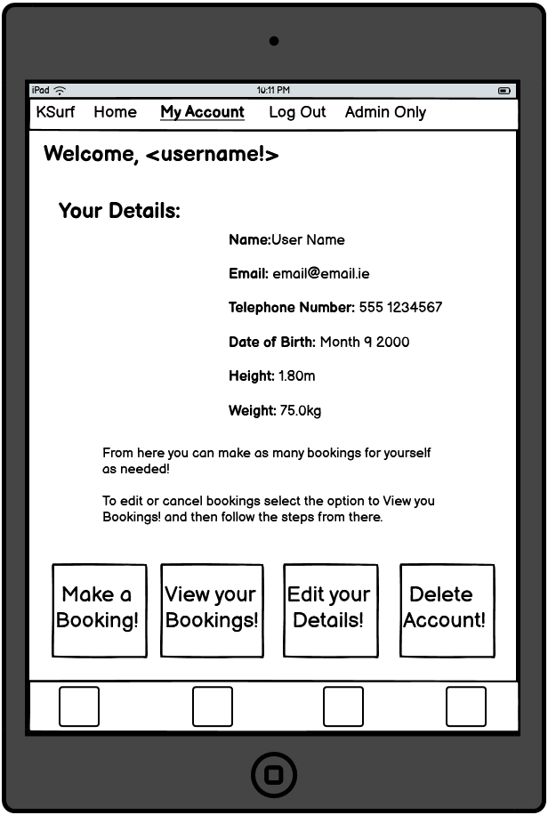
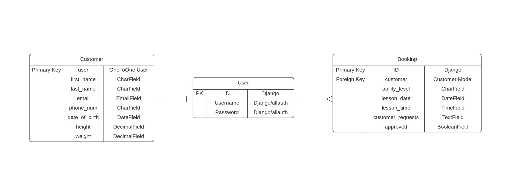

## 1. Purpose of the project
## 2. user stories
## 3. Features
## 4. future features
## 5. Typography and color scheme
## 6. wireframes

### 6.1 Home Page

### 6.2 Sign Up/ Log In

### 6.3 Sign Up

### 6.4 Log In

### 6.5 User Account after first Log In

### 6.6 User Account

### 6.7 Create Profile

## 7. Database Entity Relationship Diagram

## 8. technology
## 9. testing
### 9.1 code validation
### 9.2 test cases (user story based with screenshots)
### 9.3 fixed bugs
### 9.4 supported screens and browsers
## 10. Deployment
### 10.1 via gitpod
### 10.2 via github pages
## 11. credits